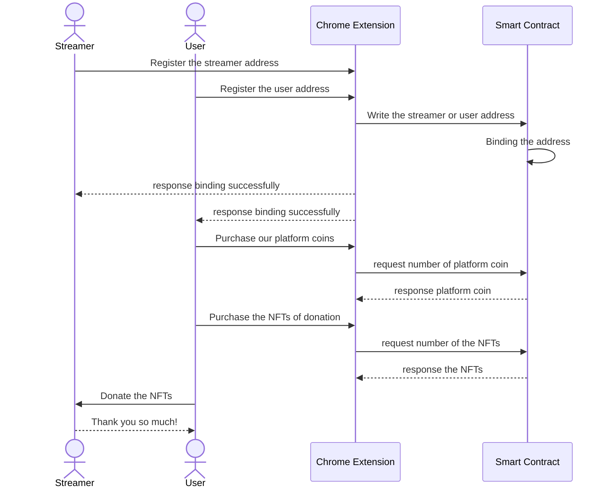

<div align="center">
<h1>Psyduck</h1>

</img>

[](https://github.com/hollow-leaf/psyduck/actions/workflows/ghpage.yml)

</div>

### Demo Page

- WebPage: [https://yakitate.pages.dev/]()
- Video: [https://youtu.be/KO6caCFEfK4?si=kjPYf8c6wgFMqF-6]()
- Psyduck Contract(Testnet): [LX6KNW6ECLJ3S7LA7Q5GNIZD72JXJHQOAHNN7SSAR73GZ6N5KEIOLGED3Y]()

### Abstract

This project presents a Chrome extension enabling viewers to donate ERC-1155 tokens, a form of non-fungible tokens (NFTs), to live streamers. Designed to integrate seamlessly with streaming platforms, the extension offers a simple, secure interface for transactions. By incorporating opBNB blockchain technology, it ensures decentralized and transparent donations. This innovation not only provides an alternative revenue stream for content creators but also enhances audience engagement. The development, user interface design, and implications for the streaming industry are discussed briefly, highlighting the potential of blockchain in digital content creation and viewer interaction.

### Introduction

This project envisions revolutionizing viewer-streamer interactions in live streaming platforms through a Chrome extension that enables donations using ERC-1155 tokens. By leveraging blockchain technology, it aims to enhance viewer engagement and provide content creators with a novel and transparent revenue stream.

Our solution has the following features and advantages:

- Facilitates meaningful viewer-streamer connections via ERC-1155 token donations
- Offers creators new monetization methods
- Ensures transparency and security with blockchain technology
- Easy integration with a simple interface for users

### Method

- Use [opBNB](https://opbnb.bnbchain.org/en) to store token donation metadata
- Use [Chrome Extension](https://developer.chrome.com/docs/extensions) to build web connect plugin that interacts with opBNB blockchain
- Use [Solidity](https://soliditylang.org/) to create smart contract by Solidity
- Use [React.js](https://react.dev/) to build chrome extension frontend

### Technical Architecture
Psyduck Architecture


Psyduck workflow


### Building & Installation

> Psyduck is a monorepo managed using turbo. You can find the source code for each package in the apps/web3 and apps/extension-app directory.

- apps/extension-app is the chrome extension for Psyduck.It is built using [Chrome Extension](https://developer.chrome.com/docs/extensions).
- app/nft is the smart contract for Psyduck.It is built using [Solidity](https://soliditylang.org/).

## Setting project
```
git clone https://github.com/hollow-leaf/psyduck/tree/main
```
```
cd apps/extension-app
```
```
nvm use 21
```
```
npm install && npm run build
```


### Contributors

- Frontend + Algorand Contract: [SoloLin](https://github.com/LinXJ1204)
- CI/CD + Frontend: [JakeKuo](https://github.com/crypto0627)
