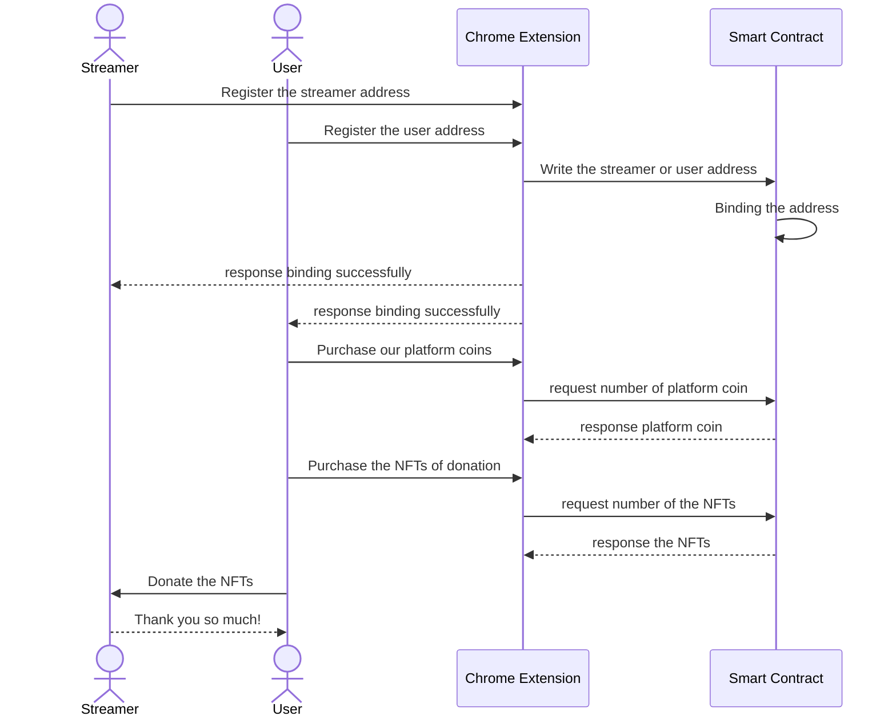

<div align="center">
<h1>Psyduck</h1>

</img>

[](https://github.com/hollow-leaf/psyduck/actions/workflows/ghpage.yml)

</div>

### Demo Page

- Video: []()
- Psyduck Contract(Testnet):
  - opBNB_testnet:
    1. [Factory](https://testnet.opbnbscan.com/address/0x5360d0Bb8Eb03C7C988b2D3B9162028e287b63A2)
    2. [Token](https://testnet.opbnbscan.com/address/0x92b9Ff2903F668B1C715cC8079e2ebC2D39ba4b7)
    3. [Globals](https://testnet.opbnbscan.com/address/0x18b91197D9FA2b39d6118D0dB5c8f1C049eCe350)
  - Avalanche_Fuji:
    1. [Factory](https://testnet.snowtrace.io/address/0x44dd4F22Ff2a54056cb37bc2F9f9aFC09A39Afd9)
    2. [Token](https://testnet.snowtrace.io/address/0xE144759591c96e678c08d54b7e551969A86C9c14)
    3. [Globals](https://testnet.snowtrace.io/address/0x1E2DCCDfa8a3fc10669f81f2Ce6b7F425983cfE2)
  - Avalanche_Subnet (chainId:1141776, [RPC URL](https://subnets.avacloud.io/a204496f-1767-4226-8cac-ffe7a2224b7f)):
    1. Factory : 0xE144759591c96e678c08d54b7e551969A86C9c14
    2. Token : 0x0eDE01A62360a4D92d7CaaC38d7701e95142EFb5
    3. Global : 0x563B972f0CdE62b8a4dC64Ad7CFde9578465B7e9

### Abstract

This project presents a Chrome extension enabling viewers to donate ERC-1155 tokens, a form of non-fungible tokens (NFTs), to live streamers. Designed to integrate seamlessly with streaming platforms, the extension offers a simple, secure interface for transactions. By incorporating opBNB and Avalanche blockchain technology, it ensures decentralized and transparent donations. This innovation not only provides an alternative revenue stream for content creators but also enhances audience engagement. The development, user interface design, and implications for the streaming industry are discussed briefly, highlighting the potential of blockchain in digital content creation and viewer interaction.

### Introduction

This project envisions revolutionizing viewer-streamer interactions in live streaming platforms through a Chrome extension that enables donations using ERC-1155 tokens. By leveraging blockchain technology, it aims to enhance viewer engagement and provide content creators with a novel and transparent revenue stream.Blockchain technology provide:

- Increase Transparency: Blockchain's transparency allows audiences to clearly see how their donations, purchases, or participation are processed and utilized, enhancing trust and willingness to engage.

- Create New Interactive Methods: Utilizing blockchain, unique digital assets (e.g., NFTs) can be created, serving as rewards for audience participation. These assets may include digital art, limited-edition content, or exclusive access to specific events.

- Provide Unique Rewards and Incentives: Blockchain enables the design of unique reward mechanisms for audience participation, such as cryptocurrency rewards, ranking systems, or NFTs proving their engagement.

- Ensure Transaction Security and Decentralization: Blockchain's security and decentralization ensure the safety of user data and transactions, increasing audience desire to use blockchain-based platforms.

- Use of Smart Contracts: Smart contracts automate many interaction processes, such as donation execution, voting, or other forms of audience participation. This automation not only improves efficiency but also enhances the attractiveness of participation.

- Enhance Community and Belonging: By creating a shared, decentralized community experience, blockchain helps audiences feel integral to the community, boosting their engagement and loyalty.


Our solution has the following features and advantages:

- Facilitates meaningful viewer-streamer connections via ERC-1155 token donations
- Offers creators new monetization methods
- Ensures transparency and security with blockchain technology
- Easy integration with a simple interface for users

### Method

- Use [opBNB](https://opbnb.bnbchain.org/en) and [Avalanche](https://www.avax.network/) to store token donation metadata
- Use [Chrome Extension](https://developer.chrome.com/docs/extensions) to build web connect plugin that interacts with opBNB blockchain
- Use [Solidity](https://soliditylang.org/) to create smart contract
- Use [React.js](https://react.dev/) to build chrome extension frontend

### Extra - Integrate Core wallet , deploy on the Subnet-EVM based Devnet
https://youtu.be/A2DIcRRhYMM<VIDEO ID>

### Technical Architecture
Psyduck Architecture


Psyduck workflow


### Building & Installation

> Psyduck is a monorepo managed using turbo. You can find the source code for each package in the apps/web3 and apps/extension-app directory.

- apps/extension-app is the chrome extension for Psyduck.It is built using [Chrome Extension](https://developer.chrome.com/docs/extensions).
- app/nft is the smart contract for Psyduck.It is built using [Solidity](https://soliditylang.org/).

## Setting project
```
git clone https://github.com/hollow-leaf/psyduck/tree/main
```
```
cd apps/extension-app
```
```
nvm use 21
```
```
npm install && npm run build
```


### Contributors

- Extension Frontend + Backend: [SoloLin](https://github.com/LinXJ1204)
- CI/CD + Documentation: [JakeKuo](https://github.com/crypto0627)
- Smart Contract: [AlbertCheng](https://github.com/cheng-chun-yuan)
- README.MD + PowerPoint: [Sophia](https://github.com/Showyuan)
- Leader: [JohnnyLai](https://github.com/johnny30678)
