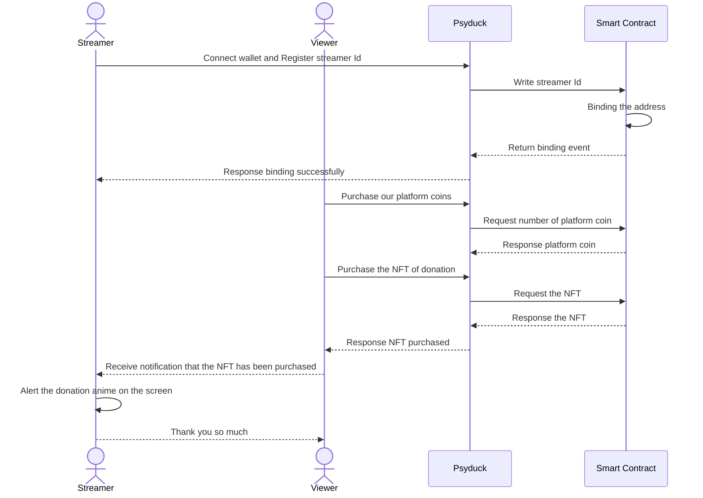

<div align="center">
<h1>Psyduck</h1>

</img>

[](https://github.com/hollow-leaf/psyduck/actions/workflows/ghpage.yml)

</div>

### Demo Page

- Video: [Psyduck demo](https://youtu.be/aFThCDy1UNg?si=9SaA8jX0pGBX45nK)
- Psyduck Contract:
  - opBNB:
    1. [PoolFactory](https://opbnb.bscscan.com/address/0x563B972f0CdE62b8a4dC64Ad7CFde9578465B7e9#code)
    2. [Psycoin Token](https://opbnb.bscscan.com/address/0x0eDE01A62360a4D92d7CaaC38d7701e95142EFb5#code)

### Abstract

We are witnessing a revolutionary tipping application on a live streaming platform, utilizing decentralized applications (DApps) and non-fungible token (NFT) technology on the opBNB chain. This application enhances interaction between viewers and live streamer, while elevating Web3 applications to new heights in real-life integration.

### Introduction

Psyduck is a decentralized application for live streaming donations that not only integrates the web3 and web2 worlds, but also provides more donation types for live streaming viewers. It innovates the interaction between live streamer and viewers. Psyduck provides a website and Chrome extension for live streamer to create NFTs and donate the tip. Viewers can donate our cryptocurrency Psycoin or purchase live streamer's NFTs to support their favorite live streamer.
<br/>
Blockchain technology provide:

- New ways to donate and interact: Psyduck uses ERC-20 and ERC-1155 for donations and live interaction.

- Provide Unique Rewards and Incentives: Blockchain enables the design of unique reward mechanisms for audience participation, such as cryptocurrency rewards, ranking systems, or NFTs proving their engagement.

- Enhance Community and Belonging: By creating a shared, decentralized community experience, blockchain helps audiences feel integral to the community, boosting their engagement and loyalty.


Our solution has the following features and advantages:

- Facilitates meaningful viewer-streamer connections via ERC-1155 token donations
- Offers creators new monetization methods
- Ensures transparency and security with blockchain technology
- Easy integration with a simple interface for users

### Method

- Use [opBNB](https://opbnb.bnbchain.org/en) to store token donation metadata
- Use [Chrome Extension](https://developer.chrome.com/docs/extensions) to build web connect plugin that interacts with opBNB blockchain
- Use [Solidity](https://soliditylang.org/) to create smart contract
- Use [React.js](https://react.dev/) to build frontend
- Use [Cloudflare_serverless](https://developers.cloudflare.com/pages/framework-guides/deploy-a-hono-site/) to build serverless

### Technical Architecture
Psyduck Architecture


Psyduck workflow


### Building & Installation

> Psyduck is a monorepo managed using turbo. You can find the source code for each package in the apps/web and apps/extension-app directory.

- apps/extension-app is the chrome extension for Psyduck. It is built using [Chrome Extension](https://developer.chrome.com/docs/extensions).
- package/contract is the smart contract for Psyduck. It is built using [Solidity](https://soliditylang.org/).

## Setting project
### Run Chrome extension
```
git clone https://github.com/hollow-leaf/psyduck/tree/main
```
```
cd apps/extension-app
```
```
nvm use 21
```
```
npm install --legacy-peer-deps && npm run build:ext
```
Then go to [chrome extension manager](chrome://extensions/)


### Run Frontend
```
pnpm install
```
```
cd apps/web
```
```
pnpm run dev
```

### Contributors

- FullStack developer: [Solo Lin](https://github.com/LinXJ1204)
- Frontend engineer: [Jake Kuo](https://github.com/crypto0627)
- Smart Contract developer: [Albert Cheng](https://github.com/cheng-chun-yuan)
- Frontend engineer: [Sophia Liang](https://github.com/Showyuan)
